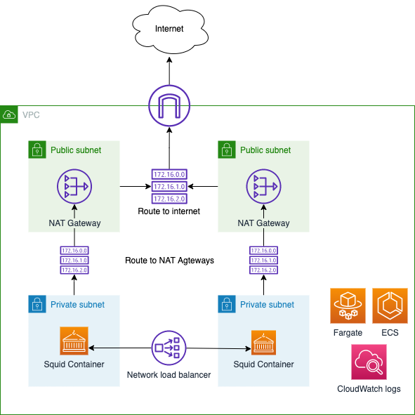
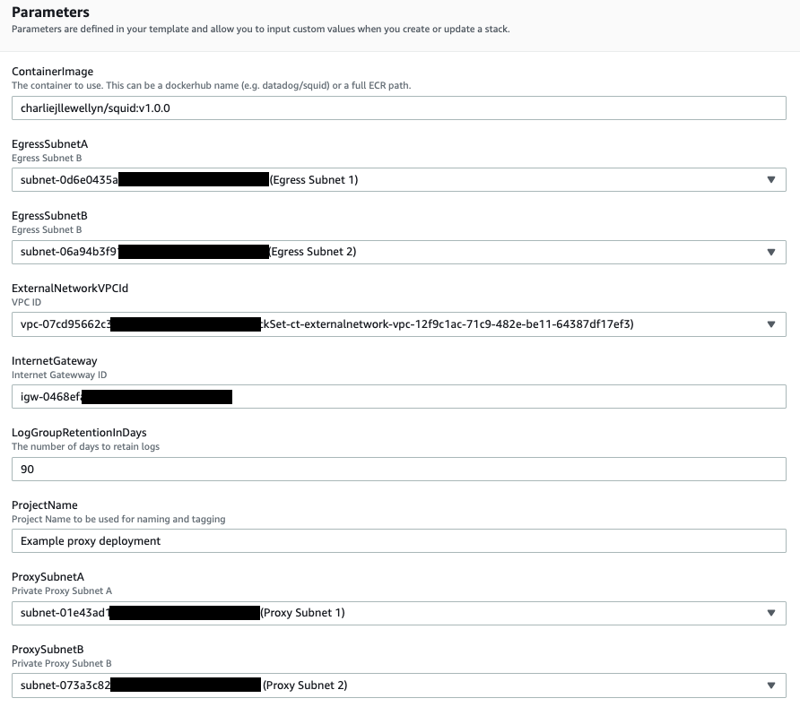

# Overview

This squid proxy has been built for use with AWS Fargate and Amazon PrivateLink. The proxy has been configured to:

- Implement proxy protocol v2 to enable the orginal source IP to be captured
- Integrate container logging with CloudWatch so proxy audit logs can be captured
- Utilise autoscaling groups to scale the number of containers between 3 and 10 based on load
- Implement basic health checks to recover from application failure
- Allow customisable allow list for domains

It is designed to be deployed into an existing VPC with the following resources having been pre-cerated:

- Internet gateway
- 2 public subnets (used for NAT gateways for outbound access)
- 2 private subnets (used to host the squid conatiners in Amazon Fargate)

**Note:** The solution will create new route tables for all subnets overriding any existing routing you may have in place.

The diagram below shows the high level architecture for the deployment.



**Note:** This has not been tested for production use. Use this at your own risk.

## Build

To build the container:

- Clone the repo
- Run the following command
```
docker build . --tag <docker hub username>/squid:<verion number>
```

## Deployment

To deploy the solution perfom the following steps.

**Note:** you will need a docker hub account. Follow these steps to get setup https://docs.docker.com/docker-hub/repos/.

- Push the image to docker hub.
```
docker push <docker hub username>/squid:<verion number>
```
- Deploy the [Cloudformation script](cloudformation/example-proxy-product.yaml)
- Update the parameters to match your configuration details e.g.



## Customising the domain allow list

To customise the domain allow list:
- Add your domains to **domain_allow_list.txt** 
- Follow the steps to build above (updating the version number in the tag)
- Push the container
- Once the container has been pushed to Docker Hub update the CloudFormation stack parameter *ContainerImage* with the new container tag with updated version number to update the container.
